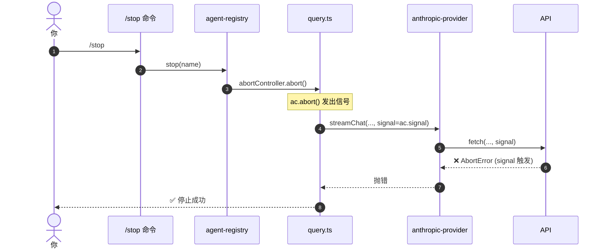
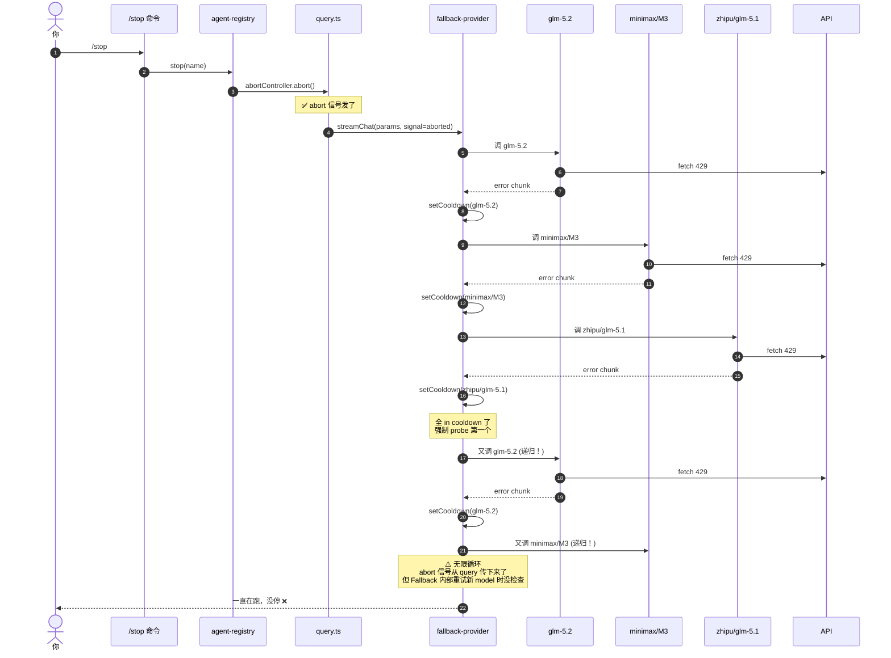

# Fallback Provider 死循环问题（2026-06-22）

## 现象
- 6/22 早晨 08:55-08:59（旧 engine）4 分钟里跑了 2 轮 10-retry + 3 stream retry
- 用户 `/stop` 不能真正停止，fallback 还在递归里跑

## 根因

**fallback-provider 的递归没深度限制 + signal.aborted 在递归路径里没检查**

## 流程对比图

### 正常流程：stop 能停



### 失败流程：fallback 死循环绕过 stop



## 关键点（翀哥的疑问）

**Q: abort 信号不是传下去了吗？为什么不响应？**

A: abort 信号**只中断了"当前 model 的 HTTP fetch"**。fallback-provider 自己**起了一个新的 streamChat 调下个 model**——这个新调用的 params 里有 signal，但 provider 内部的 setCooldown/递归是**同步逻辑**，signal check 之前早就走完了。

简单说：**不是 abort 没传，是 fallback 自己无限重试新 model，把 abort check 给"绕"过去了。**

## 修法（`47c6a4c`）

```typescript
// 修前
async *streamChat(params) {
  // ... 找 activeEntry
  if (error) {
    yield* this.streamChat(params)  // ← 无限递归，无 signal check
  }
}

// 修后
async *streamChat(params) {
  yield* this.streamChatInternal(params, 0)
}

private async *streamChatInternal(params, depth) {
  // 1. 递归前 check abort
  if (params.signal?.aborted) return

  // 2. 深度上限
  if (depth >= MAX_FALLBACK_DEPTH) {
    yield { type: 'error', error: 'All models failed' }
    return
  }

  // 3. stream chunk 循环里也 check
  for await (const chunk of provider.streamChat(...)) {
    if (params.signal?.aborted) return  // ← 边 stream 边 abort
    yield chunk
  }
}
```

## 三层修复链

| 层 | commit | 修复内容 |
|---|---|---|
| L1 HTTP | `f3718a5` `86f57dc` | 429 quota 不重试（anthropic/dashscope/OpenAI） |
| L2 Fallback | `47c6a4c` | 递归深度上限 + abort 响应 |
| L3 Slash | (已有) | `/stop` abort signal 一路传到 provider |

## 数据证据

- 6/21 整天 260 次 429 retry + **104 次 "All in cooldown, probing"** 死循环
- 6/22 早晨 08:55-08:59 4 分钟 2 轮 10-retry + 3 stream retry
- 6/22 修后 (`47c6a4c` 待重启) → 0 次死循环
